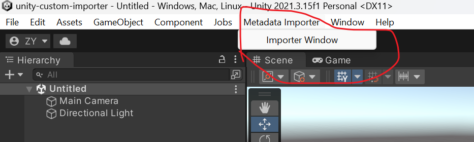
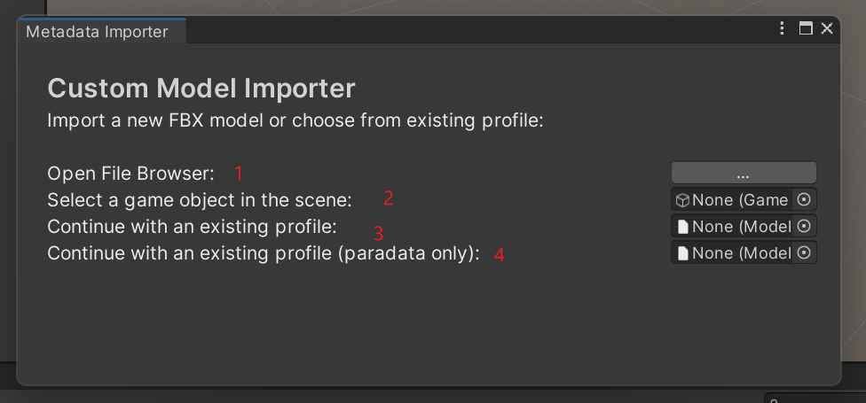
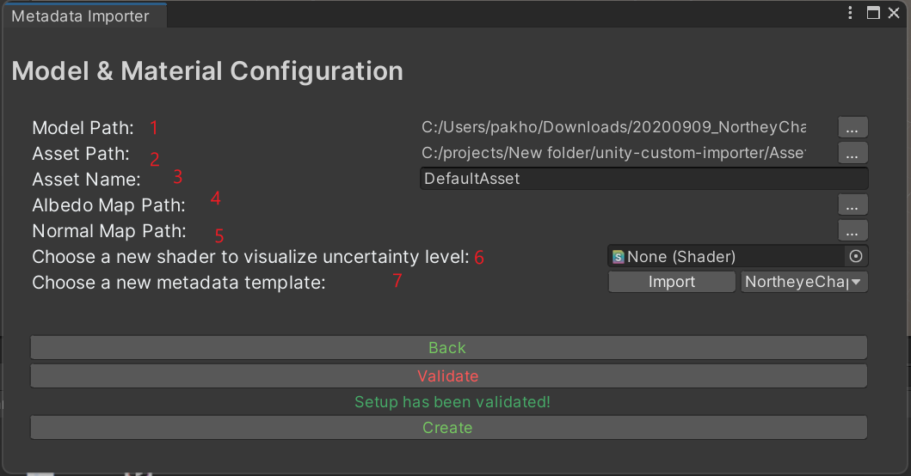
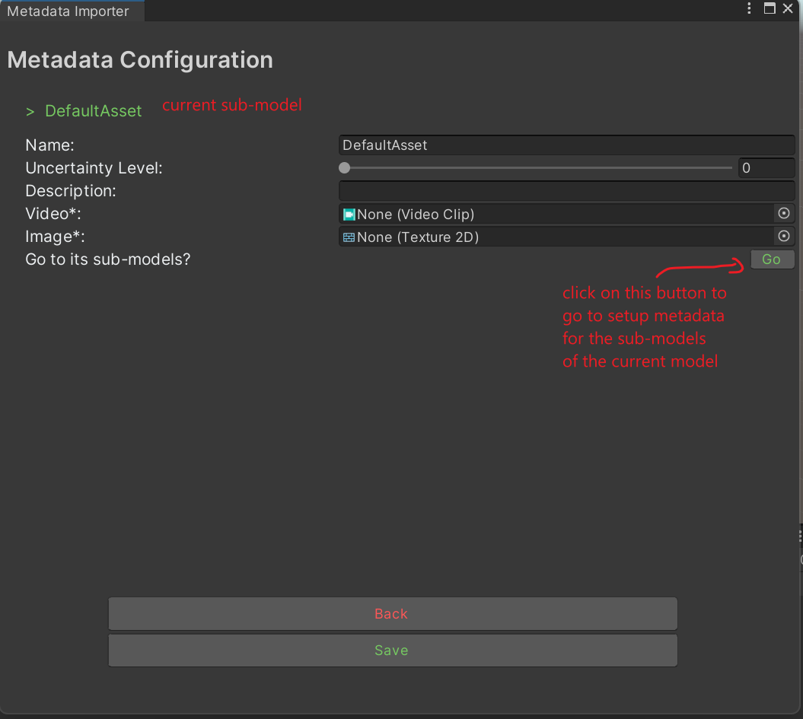
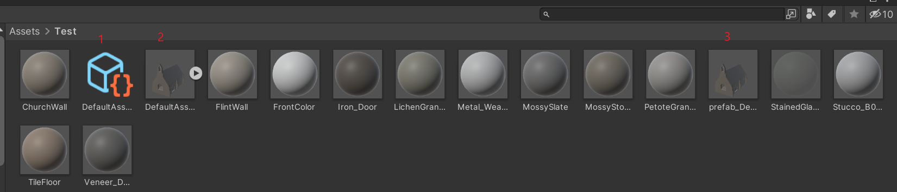
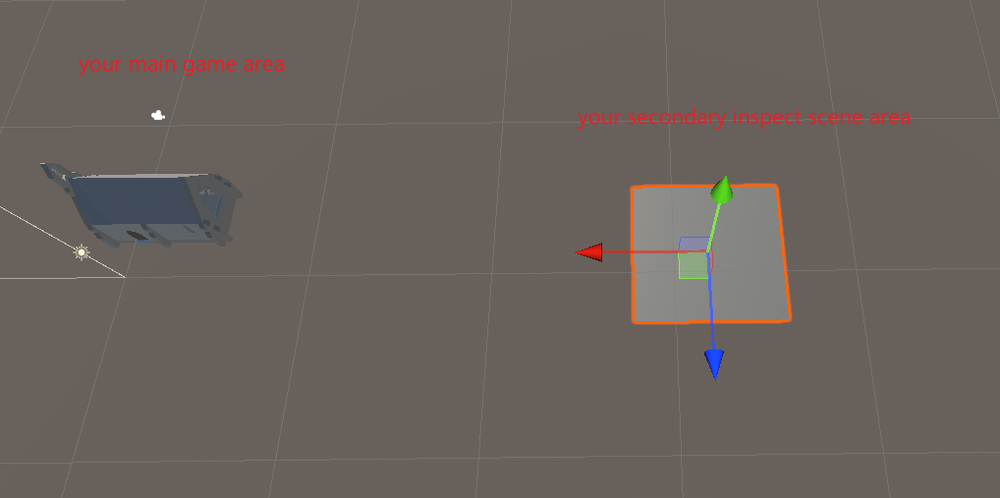
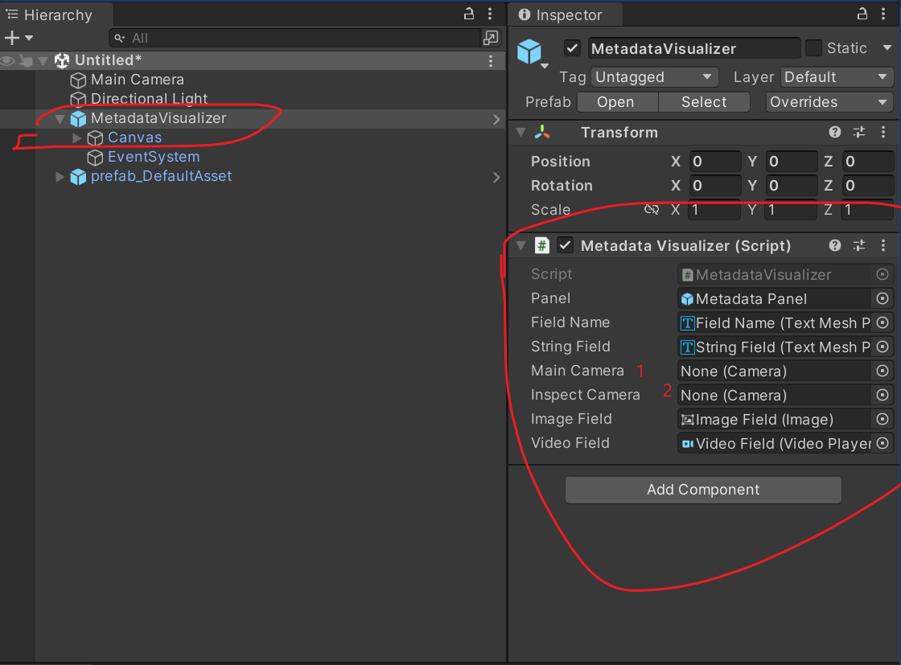

# Metadata Importer & Visualizer 

This Unity project simplifies the process of embedding various types of metadata into FBX models and their sub-models within Unity. Currently, the supported metadata types includes string, images and videos. 
This plugin also comes with runtime scripts that helps user to create games/3D applications. These scripts allow users to view and export the metadata attached to all objects within a scene.

## Features
* Metadata Attachment: Embed strings, images, and videos into FBX models and their sub-models.
* Runtime Support: Visualize the attached metadata during runtime.
* Export Functionality: Easily export the attached metadata into JSON format for further analysis or integration with other systems.

## 🔊 Demos

coming soon.

## 🤖 Installation & Usage

### I. Environment Setup
This project uses Unity 2021.3.15f1 and the Universal Render Pipeline (URP). To minimize potential issues caused by version mismatches, I recommand using the same Unity version. Here's how you can get started:

* Download Unity 2021.3.15f1: Ensure that you are using the specified version to maintain compatibility with the project's settings and features.
* Check Out the Project: Open the project within Unity. If you already have an existing Unity project, you can copy everything in the Assets/MetadataImporter folder into your Unity project. Otherwise you can use this Unity project as your starting point.
* Install URP: If you want to use this plugin in your existing Unity project, and if not already included, install the Universal Render Pipeline via Unity's Package Manager.

### II. Attach Metadata to FBX Models
The plugin adds an top bar item to your unity editor, simply click on it to open the main metadata importer window.

To begin attaching metadata to your FBX model, the tool provides four options:

1. Pick an FBX model from your local computer, and the tool will automatically import the FBX file into your Unity project.
2. Select a GameObject from an active Unity scene.
3. Continue with an existing metadata profile.
4. Similar to option 3, but this one only allows you to modify all the paradata fields.

If you want to create a new metadata profile(option 1&2), the tool adds an extra step for you to fully customize how you want to create your metadata:
1. path to your fbx model on your local machine (only meaningful when you choose option 1 on the last stage)
2. path to the new metadata profile
3. name of the new metadata profile
4. obsolete
5. obsolete
6. uncertainty level is a special metadata field in this project, this option allows user to pick a shader that visualizes the uncertainty level during runtime.
7. user can use csv to customize the fields of the metadata. The detailed instructions to setup a metadata template can be found in unity-custom-importer/Tools/metadata-template.

If you want to create a new metadata profile (options 1 & 2), the tool adds an extra step for you to fully customize how you want to create your metadata:

1. Path to your FBX model on your local machine (only relevant when you choose option 1 in the previous stage).
2. Path to the new metadata profile.
3. Name of the new metadata profile.
4. obsolete.
5. obsolete.
6. Uncertainty level is a special metadata field in this project; this option allows the user to pick a shader that visualizes the uncertainty level during runtime.
Users can use CSV to customize the fields of the metadata. Detailed instructions to set up a metadata template can be found in unity-custom-importer/Tools/metadata-template.

Now you are ready to set the metadata for your FBX model, starting from the root. Once you finish with the current level, you can click on the "Go" button to move to the next level sub-models in the hierarchy. When done, click the Save button to save the metadata profile.

### III. Metadata Profile & Prefab
Once you have attached metadata to your FBX model and saved it, certain files will be created in the asset path that you specified in the second step. These three files are particularly noteworthy:

1. Metadata data asset: This file contains all the metadata that you attached to your FBX models and their sub-models. If you wish to modify the metadata later, simply drag this file into the third option in the main metadata importer window.
2. Original FBX Model: This file is the original FBX model to which you attached the metadata.
3. Prefab: This is the prefab of the original FBX model, which has been configured with runtime scripts and colliders. If you want to view the metadata during runtime, drag this prefab into your game scene instead of using the original FBX model.

### IV. In-game Visualizer Setup
Setting up the in-game visualizer allows players to inspect the FBX model with its attached metadata within a designated "inspection room." Here's how to set it up:

1. Add MetadataVisualizer Prefab: Navigate to /Assets/MetadataImporter/Prefab and drag the MetadataVisualizer prefab into your active game scene. Include the prefab from step III in the scene as well.

2. Create Inspection Room: Design a separate room within your current game scene where players can inspect the FBX model. Ensure that this room is positioned far from the main game area to prevent players from seeing it during normal gameplay.

3. Set Up Inspection Camera: Create a new camera, place it within the inspection room, and disable it for now.

4. Configure MetadataVisualizer Instance: In the scene hierarchy view, click on the MetadataVisualizer instance. Within the inspector view, you'll find a component called Metadata Visualizer. Simply drag your main game camera and the new secondary camera into the corresponding fields.

